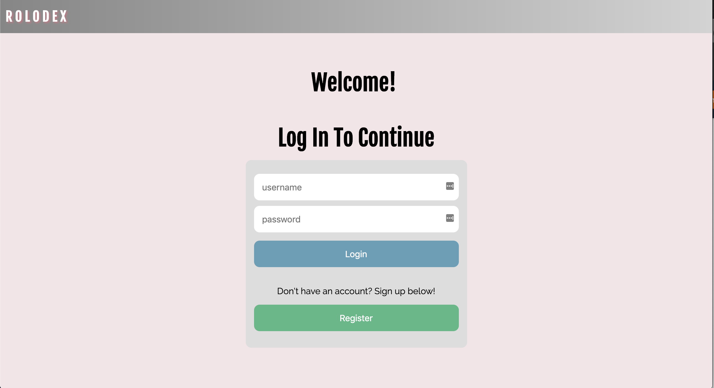
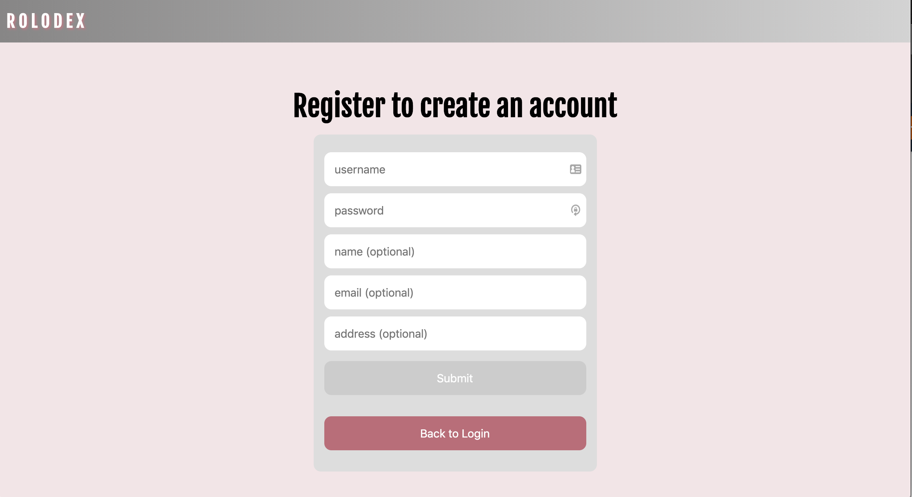
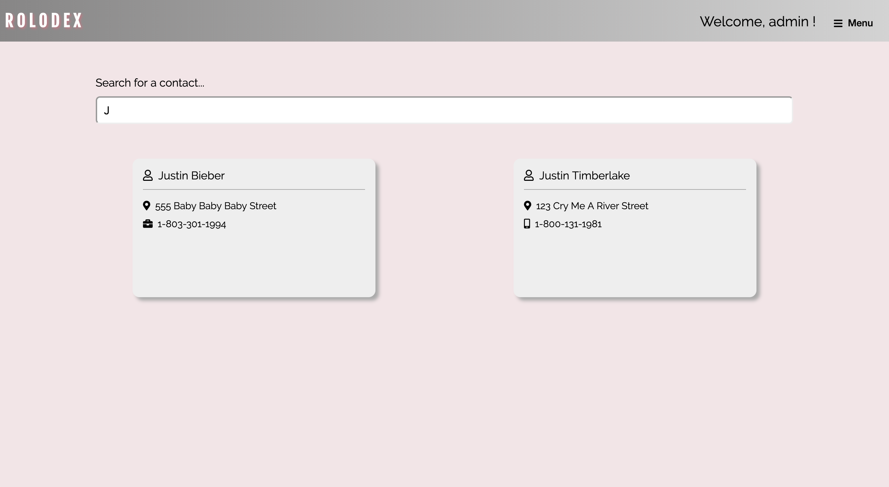
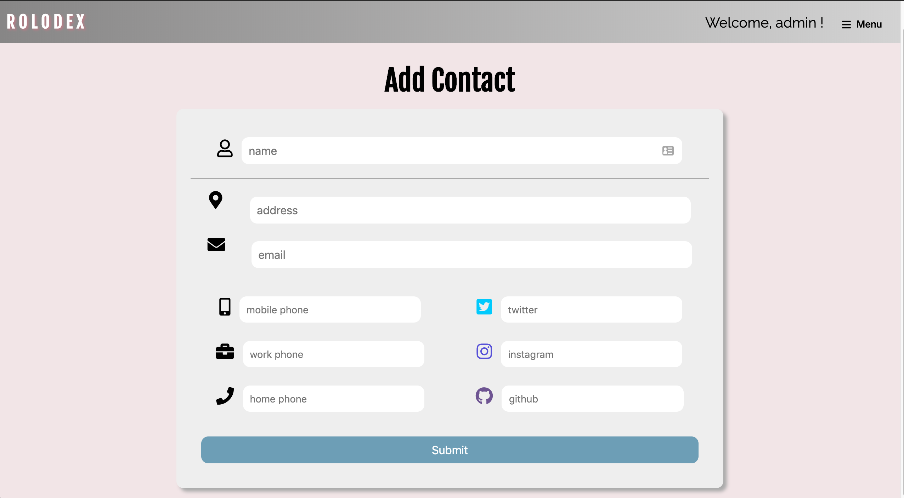

# Ng-Rolodex

*A Rolodex is a rotating file device used to store business contact information. Its name is a portmanteau of the words rolling and index. - [Wikipedia](https://en.wikipedia.org/wiki/Rolodex)*

This project is a virtual Rolodex built using Angular and PostgreSQL.

## Technologies & Frameworks Used

* Angular
* Redis
* Bcryptjs
* Bookshelf.js
* Express
* Express Session
* Knex.js
* Passport.js
* PostgreSQL

## Screenshots

___

---

---
